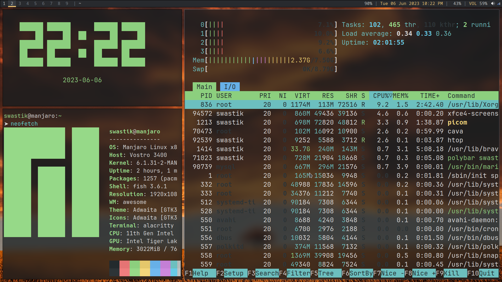

# dotfiles
My config files for Linux customization.
Basic Setup look


## Extras
1. Install Fish
```
sudo apt-add-repository ppa:fish-shell/release-3
```
```
sudo apt-get update && sudo apt-get upgrade
```
```
sudo apt-get install fish
```
Set Fish as Default shell
```
sudo chsh -s /usr/local/bin/fish
```

2. Add Starship
   
Install Starship
```bash
curl -sS https://starship.rs/install.sh | sh
```
Add starship to normal bash `~/.bashrc`

```bash
eval "$(starship init bash)"
```

Add the following to the end of `~/.config/fish/config.fish:`
```bash
starship init fish | source
```
